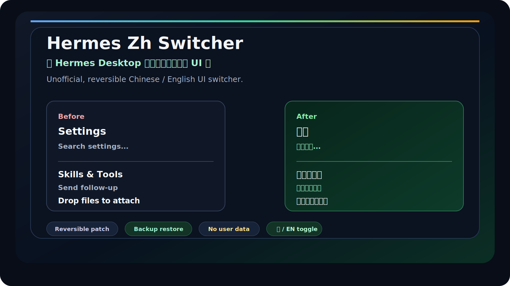

# Hermes Zh Switcher / Hermes 中文 UI 切换器

Hermes Zh Switcher 是一个非官方的 Hermes Desktop 中文 UI 切换器和本地安装器，用来给 macOS 上已有的 Hermes app 增加可关闭的中文界面层。它只向 Hermes Desktop 前端 `app.asar` 注入可卸载的 UI 脚本，不修改 Hermes 后端、模型请求、API Key、本地记忆、知识库、机器人、Gateway、MCP 或工具调用逻辑。

This is an unofficial Hermes Desktop Chinese localization / UI switcher for users searching for Hermes 中文化, Hermes Desktop zh-CN, macOS app.asar UI patching, and reversible local i18n overlays.




## What It Solves

| Problem | What this project does |
| --- | --- |
| Hermes Desktop UI is mostly English | Adds a Chinese/English `中/EN` toggle in the renderer UI |
| There is no stable official global i18n plugin API | Uses a local, reversible `app.asar` UI injection |
| Users worry about app/data safety | Backs up `app.asar`, supports uninstall, and avoids user data/config |
| Hermes updates may overwrite local patches | Provides an update helper: uninstall patch -> run upstream update -> reinstall patch -> verify |

## 30-Second Start

This project does not distribute Hermes Desktop. Install Hermes from its official channel first, quit Hermes, then run:

```bash
git clone https://github.com/flag0x369/hermes-zh-switcher.git
cd hermes-zh-switcher
npm run check
node scripts/install.mjs --app /Applications/Hermes.app --dry-run
node scripts/install.mjs --app /Applications/Hermes.app --yes
open -n /Applications/Hermes.app
```

After installation, a `中/EN` switch appears in the lower-right corner of Hermes Desktop.

## Safety Scope

| Area | Behavior |
| --- | --- |
| `/Applications/Hermes.app/Contents/Resources/app.asar` | Modified in place after backup |
| `dist/index.html` inside `app.asar` | Receives a small script injection marker |
| `dist/hermes-zh-ui.js` inside `app.asar` | Added as the UI switcher script |
| `/Applications/Hermes.zh.app` | Not created |
| `~/.hermes`, profiles, model config, Gateway config | Not modified |
| API keys, tokens, cookies, credentials | Not read |
| Environment variables, config keys, model IDs, tool IDs | Preserved in English |
| macOS signing | Re-signed ad-hoc after local bundle modification |

Read the longer safety notes in [docs/SAFETY.md](docs/SAFETY.md).

## Commands

### Verify Current Install

```bash
node scripts/verify.mjs --app /Applications/Hermes.app
```

### Uninstall

```bash
node scripts/uninstall.mjs --app /Applications/Hermes.app --yes
```

Uninstall removes the injection marker and `dist/hermes-zh-ui.js` from `app.asar`. It does not delete Hermes or user data.

### Update Hermes Safely

```bash
node scripts/update-hermes.mjs --app /Applications/Hermes.app --yes
```

The helper runs this sequence:

1. Uninstall the Chinese UI injection.
2. Run upstream `hermes update --yes`.
3. Reinstall the Chinese UI injection.
4. Verify the patch state.

If you use Hermes' native updater directly, the update should not be blocked. The patch may disappear because upstream replaces `app.asar`; rerun the install command afterward.

### Dry Run

```bash
node scripts/install.mjs --app /Applications/Hermes.app --dry-run
node scripts/uninstall.mjs --app /Applications/Hermes.app --dry-run
node scripts/update-hermes.mjs --app /Applications/Hermes.app --dry-run
```

## Verification

```bash
npm run check
node scripts/verify.mjs --app /Applications/Hermes.app
npm run safety:check
npm run audit:runtime -- --limit 220
```

Release/package checks:

```bash
npm run check
npm pack --dry-run
node scripts/install.mjs --app /Applications/Hermes.app --dry-run
node scripts/update-hermes.mjs --app /Applications/Hermes.app --dry-run
```

The old copy-install route is intentionally rejected:

```bash
node scripts/install.mjs --app /Applications/Hermes.app --copy /tmp/Hermes.zh.app --dry-run
```

That command should fail before modifying files.

## Translation Coverage

The UI script translates common Hermes Desktop labels, settings, setup screens, tool sections, model/provider controls, messaging connector labels, and installer/update states.

Some text intentionally remains English:

- Brand names: `OpenAI`, `Claude`, `Slack`, `WhatsApp`, `Hugging Face`
- Model/provider names and technical terms: `MCP`, `OAuth`, `Token`, `API Key`
- Commands, URLs, paths, environment variables, config keys, tool IDs, skill IDs
- User-generated content, chat messages, terminal output, code, markdown, logs

## Troubleshooting

### Hermes Is Running

Quit Hermes before installing or uninstalling. Patching `app.asar` while the app is running can leave the bundle in an inconsistent state.

### Chinese UI Disappears After Update

Hermes updates can replace `app.asar`. Reinstall the patch:

```bash
node scripts/install.mjs --app /Applications/Hermes.app --yes
```

### macOS Reports Signing Or Source Changes

Local `app.asar` modification changes the app bundle. This project re-signs the selected app ad-hoc so it can launch locally. Apple notarization is not preserved after local patching; that is a normal limitation of this approach.

### Installer Fails

The installer backs up the original `app.asar` before writing and attempts rollback if writing, signing, or injection verification fails. Backups are stored under:

```text
~/Library/Application Support/hermes-zh-switcher/backups/
```

## Project Docs

- [docs/SAFETY.md](docs/SAFETY.md): write scope, backups, restore, and sensitive-data boundary.
- [docs/ROADMAP.md](docs/ROADMAP.md): supported, near-term, and not-planned work.
- [docs/SCREENSHOTS.md](docs/SCREENSHOTS.md): public screenshot and redaction rules.
- [docs/RELEASE_TEMPLATE.md](docs/RELEASE_TEMPLATE.md): release notes template.
- [CONTRIBUTING.md](CONTRIBUTING.md): contribution scope and verification checklist.

## GitHub Metadata

Suggested description:

```text
Unofficial Chinese UI switcher and reversible local app.asar patcher for Hermes Desktop on macOS.
```

Suggested topics:

```text
hermes-desktop, zh-cn, i18n, localization, macos, electron, app-asar, developer-tools
```

## Long-Term Stability

This project cannot guarantee compatibility with every future Hermes Desktop version. Hermes may change frontend bundle names, `index.html` shape, Electron packaging, or update behavior. The installer and verifier should fail loudly when structure does not match instead of guessing.

The best long-term solution is official Hermes Desktop i18n support.

## License

MIT
